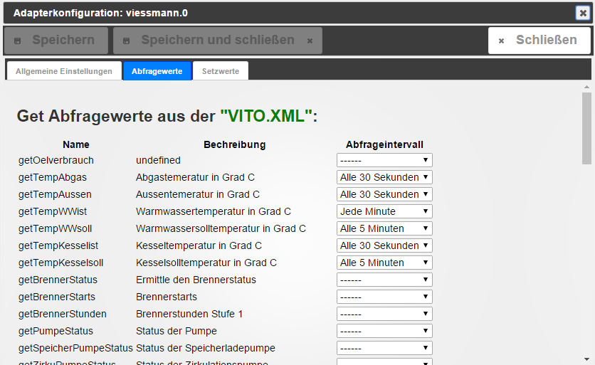

# ioBroker.viessmann
=================

Mit diesem Adapter ist es möglich, Werte aus einer Viessmann Steuerung 
die mit dem Programm [Vcontrold](https://openv.wikispaces.com/vcontrold) kommuniziert, 
in Objekten zu speichern. Ebenso ist das Setzen von Werten, die man in seiner Vito.xml konfiguriert hat möglich.

Um die Kommandos aus der VITO.XML einzulesen, ist es nötig, diese in ein JSON Format umwandeln. Dies ist z.B. [HIER](http://www.utilities-online.info/xmltojson/#.WFVQv_DhA1I) möglich!  
Vorsicht!: Bei jedem neuen einlesen der JSON Daten, werden die Einstellungen gelöscht.

Es ist empfehlenswert, bei relativ unwichtigen Abfragewerten, ein möglichst grosses Abfrageintervall zu wählen. 

*Bitte erst die JSON einlesen und dann die Netzwerkeinstellungen im Adapter ändern.*  

*die benutzten Bilder stammen von www.viessmann.com.*
### Changelog

#### 0.2.5
* (Sineos) format values

#### 0.2.4
* (misanorot) fix issue with connection timeout

#### 0.2.3
* (misanorot) add links in admin settings

#### 0.2.2
* (misanorot) delete line break in state values

#### 0.2.1
* (misanorot) check import vito.xml

#### 0.2.0
* (misanorot) eliminate "get&set" in states 

#### 0.1.4
* (misanorot) substring "vctrold>" 

#### 0.1.3
* (misanorot) change grammar issues 

#### 0.1.2
* (misanorot) implement set commands 
* (misanorot) add info.connection state

#### 0.1.1
* (misanorot) reconnection after timeout error
* (misanorot) fix issue with first run

#### 0.1.0
* (misanorot) revised and updated the complete adapter

#### 0.0.2
* (misanorot) create State JSON_table for show in VIS

#### 0.0.1
* (misanorot) initial release

### License

The MIT License (MIT)

Copyright (c) 2017 misanorot <audi16v@gmx.de>

Permission is hereby granted, free of charge, to any person obtaining a copy
of this software and associated documentation files (the "Software"), to deal
in the Software without restriction, including without limitation the rights
to use, copy, modify, merge, publish, distribute, sublicense, and/or sell
copies of the Software, and to permit persons to whom the Software is
furnished to do so, subject to the following conditions:

The above copyright notice and this permission notice shall be included in
all copies or substantial portions of the Software.

THE SOFTWARE IS PROVIDED "AS IS", WITHOUT WARRANTY OF ANY KIND, EXPRESS OR
IMPLIED, INCLUDING BUT NOT LIMITED TO THE WARRANTIES OF MERCHANTABILITY,
FITNESS FOR A PARTICULAR PURPOSE AND NONINFRINGEMENT. IN NO EVENT SHALL THE
AUTHORS OR COPYRIGHT HOLDERS BE LIABLE FOR ANY CLAIM, DAMAGES OR OTHER
LIABILITY, WHETHER IN AN ACTION OF CONTRACT, TORT OR OTHERWISE, ARISING FROM,
OUT OF OR IN CONNECTION WITH THE SOFTWARE OR THE USE OR OTHER DEALINGS IN
THE SOFTWARE.
